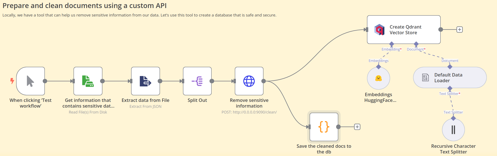

Hello! Today we will look at the automation tool [n8n](https://n8n.io/).

The service's core functionality is straightforward. It provides pre-built nodes that can be accessed via a web-based interface to automate workflows within a team or organization, or even some personal tasks.

Additionally, n8n is a developing project. While its blocks may not cover every possible scenario for data manipulation, it is likely that developers will add additional functionality over time. Nevertheless, most of the available n8n components are already sufficient for implementing basic workflows (and even those with an AI element). Furthermore, the platform offers over 1,000 pre-existing [worfkflows](https://n8n.io/workflows/) created by other users.

Regarding our company, we have a project involving the removal of sensitive data. The main technology is llama-3.2, a fine-tuned model capable of identifying 20 different types of sensitive information that can be deleted through functional calls. We will explore two potential use cases for n8n in relation to this project.

#### Case #1: Cleaned database and vector search 

We have a client who wishes to remove sensitive data from their documents and store them in a database. Furthermore, the client has several use cases in mind for the database after this. For instance, they may use the database in a customer support service, such that, when a service provider assists a client with a query, the service provider can consult the database for previous similar cases and develop a strategy to assist the customer further.

In general, such a pipeline will be divided into two blocks. 

In general, such a system can be divided into two main parts. The first part is creating a data storage system and building a vector database:

In this example, our tool works locally on port 9090. Its functionality is demonstrated as follows:

As we can see, the sensitive data was replaced with ****.
Then these documents are saved in a clean format in the database and vector store. This is how the process looks like completely::

 
The second part is the extraction of the necessary documents. We can do this by:

Using the chat node, we submit a request to the generated vector database and receive the result:

Full launch:

#### Сценарий #2: Evaluation
Our project is in development, and we are adding additional heuristics in order to improve the detection of sensitive data. As such, we require continuous testing. n8n provides a good opportunity for continuous testing, and this framework even includes time-based triggers. For illustration, let us consider a trigger that is activated when a test file is added to a folder.

Our project has already implemented a basic command line interface for running tests. This interface reads data from a file specified by the user and outputs the results to the console. We plan to use this interface in n8n.

As the service also requires its initial settings in order to function, we will specify them in the `prepare parameters for evaluation` node. After that, we will save these settings in the `auto_config.json` file, whose path we will submit to the testing interface through the n8n `run evaluation` node.

This is how the testing process will be conducted. All test results will need to be captured, of course. There are several options for storing data in n8n, including using the API of specific database providers, saving to Google Sheets, local storage, or even ploting a graph. In order to better understand the analysis, we have chosen the latter option. The results will be presented as follows:

And this is the full testing process:

